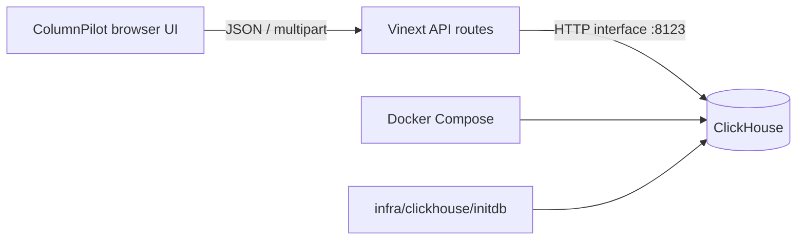

# Architecture

ColumnPilot is a small full-stack web console. The browser never connects to ClickHouse directly; all ClickHouse traffic goes through the application API routes.

## Main directories

- `app/`: application entry points and API routes.
- `components/`: ColumnPilot UI and the small set of reusable UI primitives it uses.
- `lib/clickhouse/`: connection validation, query execution, imports, and shared types.
- `infra/clickhouse/`: Docker initialization SQL.
- `docs/`: architecture and development notes.
- `scripts/` and `build/`: Vinext/Sites build compatibility files.

## Security boundaries

- SQL submitted through the workbench is checked server-side and restricted to read-only statements.
- Import writes are only exposed through the dedicated import route.
- Credentials are sent to the application API for each request and are not persisted by ColumnPilot.
- Hosted deployments reject private/local ClickHouse targets and require HTTPS. Local development can connect to `http://localhost:8123`.
- Database permissions remain the final authority. Use a least-privilege ClickHouse account outside local development.
