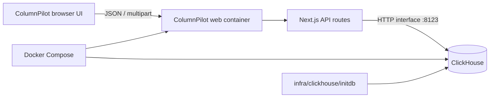

# Architecture

ColumnPilot is a small full-stack web console. The browser never connects to ClickHouse directly; all ClickHouse traffic goes through the application API routes.

## Main directories

- `app/`: application entry points and API routes.
- `components/`: ColumnPilot UI and the small set of reusable UI primitives it uses.
- `lib/clickhouse/`: connection validation, query execution, imports, and shared types.
- `infra/clickhouse/`: Docker initialization SQL.
- `docs/`: architecture and development notes.
- `Dockerfile`: multi-stage production build running as an unprivileged user.
- `compose.yaml`: complete web and ClickHouse deployment with health checks.

## Security boundaries

- SQL submitted through the workbench is checked server-side and restricted to read-only statements.
- The browser previews imports against the selected table schema, while the import API reloads that schema and validates the file again before writing.
- Validated imports name their destination columns explicitly, so omitted ClickHouse columns continue to use their configured defaults.
- Import writes are only exposed through the dedicated import route and upload size is limited on both sides of the API boundary.
- Query-result CSV and JSON exports are generated locally in the browser from the current result set.
- Credentials are sent to the application API for each request and are not persisted by ColumnPilot.
- Production deployments reject private/local ClickHouse targets and require HTTPS unless the self-hosted operator explicitly enables `COLUMNPILOT_ALLOW_PRIVATE_TARGETS`. Local development can connect to `http://localhost:8123`.
- Database permissions remain the final authority. Use a least-privilege ClickHouse account outside local development.
- The production container drops Linux capabilities, uses a read-only root filesystem, and exposes a minimal health endpoint that does not include credentials or database details.
